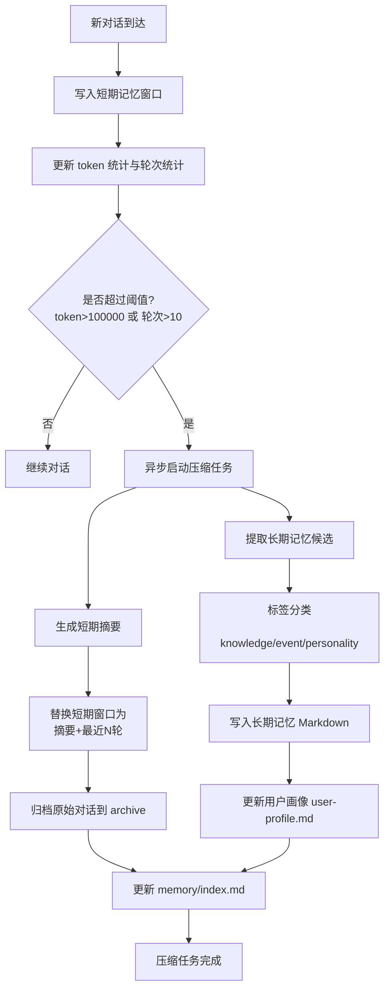

# 记忆系统建设计划（待确认）

## 1. 目标

构建一个简单可用的记忆系统，满足以下核心需求：

1. 短期记忆
- 保存历史对话。
- 当以下任一条件触发时，后台调用 AI 进行总结压缩：
  - Token 数超过 100000。
  - 对话轮次超过 10 轮。
- 压缩后保留可追溯信息，避免上下文完全丢失。

2. 长期记忆
- 在短期压缩触发时，同时后台调用 AI 生成长期记忆。
- 长期记忆按标签分类：
  - 知识类记忆
  - 事件记忆
  - 用户性格记忆
- 记忆以 Markdown 格式落盘。

3. 用户画像文件
- 对用户性格、习惯、偏好进行单独整理。
- 单独保存为一个 Markdown 文件，持续增量更新。

## 2. 范围与边界

### 本期范围
- 对话存储、阈值触发、后台压缩、长期记忆分类、Markdown 持久化。
- 简单可维护，优先稳定与可读性。

### 暂不纳入
- 向量数据库与语义检索。
- 多用户权限系统。
- 复杂冲突合并策略。

## 3. 记忆分层设计

### 3.1 短期记忆（Short-term Memory）

职责：
- 保存最近的原始对话。
- 提供触发判断输入（token、轮次）。
- 在压缩后替换为摘要块 + 最近若干轮原文。

建议结构：
- 对话条目：
  - role
  - content
  - createdAt
  - estimatedTokens
  - turnIndex

触发条件（任一满足）：
- totalTokens > 100000
- turnCount > 10

压缩策略：
- 先将待压缩区间发送给 AI，总结为短期摘要。
- 短期摘要写入短期记忆头部。
- 原始消息归档到历史文件，短期窗口中仅保留摘要 + 最近 N 轮（建议 N=4）。

### 3.2 长期记忆（Long-term Memory）

职责：
- 将压缩区间中的稳定事实、重要事件、用户特征沉淀成结构化条目。

分类标签：
- knowledge
- event
- personality

长期记忆条目建议字段：
- id
- tag
- summary
- evidence（来源轮次范围或片段）
- confidence（low, medium, high）
- updatedAt

### 3.3 用户画像（Profile Memory）

职责：
- 汇总用户长期稳定偏好与行为模式。
- 单独文件存储，便于直接读取与更新。

建议维度：
- 沟通风格偏好
- 技术偏好
- 工作习惯
- 禁忌与限制
- 长期目标

## 4. 持久化方案（Markdown）

建议目录结构：

- memory/
  - short-term/
    - active-session.md
    - archive/
      - session-YYYYMMDD-HHMM.md
  - long-term/
    - knowledge.md
    - events.md
    - personality.md
  - profile/
    - user-profile.md
  - index.md

文件职责：
- active-session.md：当前短期记忆窗口（摘要 + 最近轮次）。
- archive/*.md：被压缩前的原始对话归档。
- knowledge.md / events.md / personality.md：长期记忆分类池。
- user-profile.md：用户画像单独维护。
- index.md：总索引与最后更新时间。

## 5. 后台流程图

## 6. 处理策略细节

### 6.1 触发与并发控制
- 使用单飞锁，避免同一会话重复压缩。
- 压缩任务失败不阻断主对话流程。
- 失败写入错误日志，支持下次补偿重试。

### 6.2 Token 估算策略
- 先使用轻量估算（字符长度近似）。
- 后续可替换为模型专用 tokenizer。
- 统一封装为 TokenEstimator，便于替换。

### 6.3 AI 输出约束
- 为短期摘要与长期记忆提取分别定义固定输出模板。
- 输出必须可解析（例如 JSON 块或严格段落头）。
- 解析失败时回退到保守策略（仅保存原文归档 + 错误记录）。

### 6.4 去重与更新
- 长期记忆写入前做相似条目检查，优先更新而非重复追加。
- 用户画像采用合并更新，不重复堆叠冲突描述。

## 7. 实施分阶段（开发计划）

### 阶段 1：基础框架
- 建立 memory 目录与 Markdown 模板。
- 实现短期窗口写入与统计。
- 接入阈值判断逻辑。

### 阶段 2：短期压缩
- 实现后台压缩任务调度。
- 接入 AI 短期摘要。
- 完成摘要替换和原文归档。

### 阶段 3：长期记忆沉淀
- 实现长期记忆提取与分类写入。
- 维护 knowledge、events、personality 三类文件。
- 生成并更新 user-profile.md。

### 阶段 4：稳定性完善
- 并发锁、失败重试、解析兜底。
- 补充日志与最小可观测性。

## 8. 验收标准

1. 达到阈值后可自动触发压缩。
2. 压缩完成后短期窗口明显缩短，且保留摘要和最近对话。
3. 长期记忆可在 3 个分类文件中看到新增内容。
4. user-profile.md 自动更新且可读。
5. 所有记忆均为 Markdown 文件，重启后可恢复。

## 9. 风险与应对

- 风险：AI 输出不稳定。
  - 应对：严格模板 + 解析失败兜底。

- 风险：长期记忆噪声过多。
  - 应对：引入 confidence，并设置最低阈值写入。

- 风险：频繁触发导致成本上升。
  - 应对：冷却时间 + 批处理压缩。

## 10. 待你确认的参数

1. 短期压缩后保留最近 N 轮，默认建议 N=4，是否确认？
2. 长期记忆写入策略是追加优先，还是更新优先？默认建议更新优先。
3. 用户画像是否允许低置信度条目进入？默认建议不允许。
4. 是否需要为每次压缩生成一个任务日志文件？默认建议需要。

---

确认后将进入开发实现。
