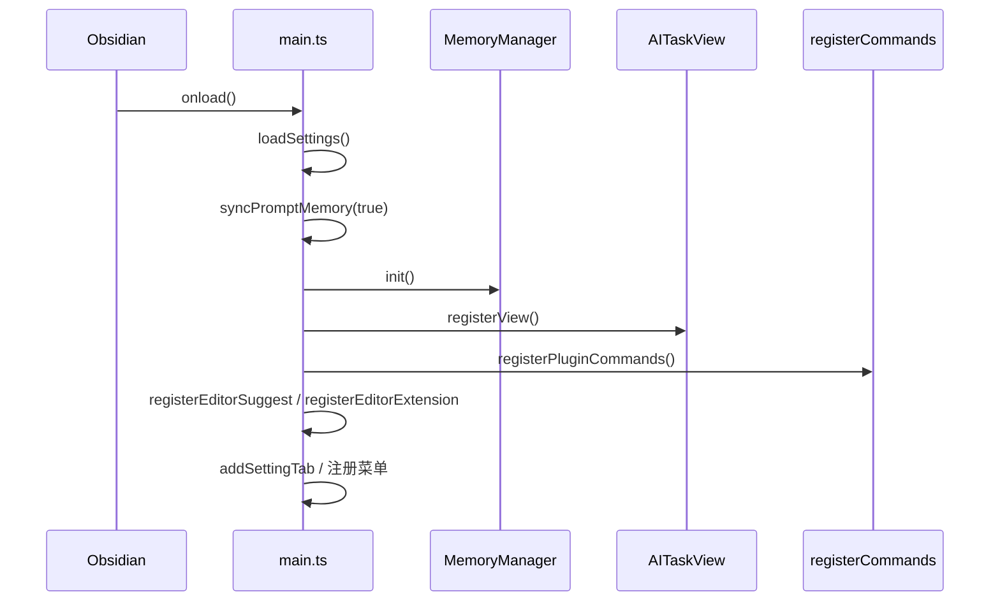
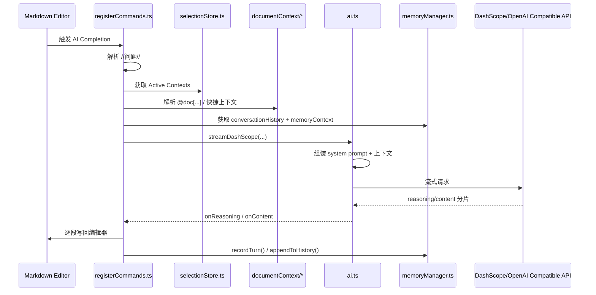
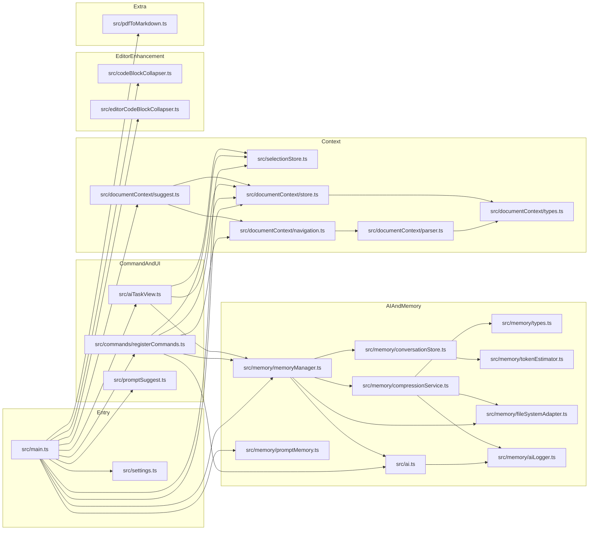

# 项目架构总览

## 1. 文档目标

本文用于快速说明这个 Obsidian 插件项目的整体架构、核心运行链路，以及各个文件的主要职责。

适合以下场景：

- 新开发者第一次接手项目
- 需要定位某个功能应该改哪个文件
- 需要理解 AI 请求、上下文管理、记忆系统、PDF 转 Markdown 的关系

---

## 2. 项目定位

这是一个围绕 Obsidian 编辑器工作流扩展出来的 AI 插件，核心能力包括：

- 选取代码块或文本，作为 AI 的活动上下文
- 通过 `@doc[...]` 选择文档上下文，按标题树注入给 AI
- 在编辑器中用 `//问题//` 直接触发 AI 流式补全
- 维护会话记忆、摘要压缩、长期记忆与用户画像
- 将 PDF 通过 PaddleOCR 转为 Markdown，并用 AI 修正标题层级

从职责上看，项目可以分为 6 层：

1. 插件装配层：`src/main.ts`
2. 命令与交互层：`src/commands/registerCommands.ts`、`src/aiTaskView.ts`
3. AI 调用层：`src/ai.ts`
4. 上下文管理层：`src/selectionStore.ts`、`src/documentContext/*`
5. 记忆系统层：`src/memory/*`
6. 编辑器增强层：代码块折叠、提示词补全、PDF 转换

---

## 3. 总体架构图

```mermaid
graph TD
    Main[src/main.ts\n插件入口与装配]
    Commands[src/commands/registerCommands.ts\n命令注册与 AI Completion]
    View[src/aiTaskView.ts\n侧栏 UI]
    AI[src/ai.ts\nPrompt 拼装与流式请求]
    SelectStore[src/selectionStore.ts\n活动上下文存储]
    DocStore[src/documentContext/store.ts\n文档上下文存储]
    DocSuggest[src/documentContext/suggest.ts\n@doc 补全]
    DocNav[src/documentContext/navigation.ts\n文档定位与快捷跳转]
    DocParser[src/documentContext/parser.ts\nMarkdown 标题树解析]
    MemoryManager[src/memory/memoryManager.ts\n记忆门面]
    ConversationStore[src/memory/conversationStore.ts\n短期对话状态]
    Compression[src/memory/compressionService.ts\n压缩与长期记忆提取]
    FSAdapter[src/memory/fileSystemAdapter.ts\n记忆文件读写]
    Logger[src/memory/aiLogger.ts\nAI 请求日志]
    PromptMemory[src/memory/promptMemory.ts\n提示词同步]
    PromptSuggest[src/promptSuggest.ts\n//// 提示词补全]
    PreviewFold[src/codeBlockCollapser.ts\n阅读模式代码块增强]
    EditorFold[src/editorCodeBlockCollapser.ts\nLive Preview 代码块增强]
    PDF[src/pdfToMarkdown.ts\nPDF OCR 转 Markdown]

    Main --> Commands
    Main --> View
    Main --> SelectStore
    Main --> DocStore
    Main --> MemoryManager
    Main --> PromptSuggest
    Main --> DocSuggest
    Main --> PreviewFold
    Main --> EditorFold
    Main --> PDF
    Main --> PromptMemory

    Commands --> AI
    Commands --> SelectStore
    Commands --> DocStore
    Commands --> DocNav
    Commands --> MemoryManager
    View --> SelectStore
    View --> DocStore
    View --> MemoryManager

    DocSuggest --> DocNav
    DocSuggest --> DocStore
    DocNav --> DocParser
    DocNav --> DocStore

    AI --> Logger
    AI --> MemoryManager
    MemoryManager --> ConversationStore
    MemoryManager --> Compression
    MemoryManager --> FSAdapter
    Compression --> FSAdapter
    Compression --> Logger
```

---

## 4. 运行链路

### 4.1 插件启动链路



### 4.2 AI 补全链路



---

## 5. 目录结构

```text
obsidian-sample-plugin/
├─ src/
│  ├─ main.ts
│  ├─ ai.ts
│  ├─ aiTaskView.ts
│  ├─ codeBlockCollapser.ts
│  ├─ editorCodeBlockCollapser.ts
│  ├─ pdfToMarkdown.ts
│  ├─ promptSuggest.ts
│  ├─ selectionStore.ts
│  ├─ settings.ts
│  ├─ commands/
│  │  └─ registerCommands.ts
│  ├─ documentContext/
│  │  ├─ navigation.ts
│  │  ├─ parser.ts
│  │  ├─ store.ts
│  │  ├─ suggest.ts
│  │  └─ types.ts
│  └─ memory/
│     ├─ aiLogger.ts
│     ├─ compressionService.ts
│     ├─ conversationStore.ts
│     ├─ fileSystemAdapter.ts
│     ├─ memoryManager.ts
│     ├─ promptMemory.ts
│     ├─ tokenEstimator.ts
│     └─ types.ts
├─ docs/
├─ manifest.json
├─ package.json
├─ esbuild.config.mjs
├─ tsconfig.json
├─ eslint.config.mts
├─ styles.css
├─ versions.json
├─ version-bump.mjs
├─ main.js
└─ data.json
```

---

## 6. 根目录文件说明

| 文件 | 主要功能 | 任务/说明 |
| --- | --- | --- |
| `manifest.json` | Obsidian 插件清单 | 定义插件 ID、名称、版本、最低 Obsidian 版本等 |
| `package.json` | Node/npm 项目配置 | 定义依赖、构建脚本、lint 脚本、版本脚本 |
| `esbuild.config.mjs` | 打包配置 | 以 `src/main.ts` 为入口，输出 `main.js` |
| `tsconfig.json` | TypeScript 编译配置 | 控制严格模式、模块解析、源码范围 |
| `eslint.config.mts` | ESLint 配置 | 对 TS 和 Obsidian 插件代码做静态检查 |
| `styles.css` | 插件样式 | 主要承载代码块折叠、侧栏按钮等界面样式 |
| `versions.json` | 版本兼容映射 | 记录插件版本与 `minAppVersion` 的映射 |
| `version-bump.mjs` | 版本更新脚本 | 发布时同步更新 `manifest.json` 和 `versions.json` |
| `main.js` | 打包产物 | 由 esbuild 生成，Obsidian 实际加载此文件 |
| `data.json` | 运行时设置数据 | 存放当前用户的插件设置与状态 |
| `README.md` | 使用说明 | 面向用户或开发者的基础介绍 |
| `AGENTS.md` | 协作约束文档 | 说明本项目的开发规则、结构与注意事项 |
| `LICENSE` | 许可证文件 | 项目开源许可说明 |

---

## 7. `src` 目录文件说明

### 7.1 入口与装配

| 文件 | 主要功能 | 关键任务 |
| --- | --- | --- |
| `src/main.ts` | 插件入口 | 加载设置、初始化记忆系统、注册视图/命令/编辑器扩展/菜单/设置页 |
| `src/settings.ts` | 设置定义与设置页 | 定义 `MyPluginSettings`、默认配置、设置 UI 与保存逻辑 |

### 7.2 AI 调用与命令执行

| 文件 | 主要功能 | 关键任务 |
| --- | --- | --- |
| `src/ai.ts` | AI 请求门面 | 格式化活动上下文与文档上下文、拼装 system prompt、发起流式请求、记录日志 |
| `src/commands/registerCommands.ts` | 命令注册中心 | 注册快捷键和命令；实现 `AI Completion` 主流程；处理选中内容、清空上下文、切换记忆/思考模式 |
| `src/aiTaskView.ts` | 侧栏视图 | 展示 Active Contexts、Document Contexts、Prompt 配置、Memory/Thinking 开关 |

### 7.3 活动上下文与代码块增强

| 文件 | 主要功能 | 关键任务 |
| --- | --- | --- |
| `src/selectionStore.ts` | 活动上下文状态管理 | 维护选中代码块/文本、历史记录、订阅通知、去重 ID 生成 |
| `src/codeBlockCollapser.ts` | 阅读模式代码块增强 | 给预览模式代码块加语言标签、选择按钮、折叠按钮、复制按钮布局 |
| `src/editorCodeBlockCollapser.ts` | Live Preview 代码块增强 | 基于 CodeMirror 装饰实现代码块折叠、复制、选择和预览 |
| `src/promptSuggest.ts` | `////` 提示词补全 | 弹出内置/自定义 prompt 建议，快速生成 `//问题//` 内容 |

### 7.4 文档上下文系统

| 文件 | 主要功能 | 关键任务 |
| --- | --- | --- |
| `src/documentContext/types.ts` | 类型定义 | 定义文档标题树、上下文项、标记、快捷项等数据结构 |
| `src/documentContext/parser.ts` | Markdown 标题解析 | 构建标题树、查找标题路径、解析当前标题、按标题切片上下文 |
| `src/documentContext/navigation.ts` | 文档导航与上下文解析 | 解析 `@doc[...]`、合并上下文、处理 `@current/@next/@pre` 等快捷跳转 |
| `src/documentContext/store.ts` | 文档上下文状态管理 | 管理当前选中文档上下文、历史记录、焦点模式、文件使用次数 |
| `src/documentContext/suggest.ts` | `@doc` 补全器 | 在编辑器中补全文件、标题、快捷方式，并把结果写入 store |

### 7.5 记忆系统

| 文件 | 主要功能 | 关键任务 |
| --- | --- | --- |
| `src/memory/types.ts` | 记忆类型定义 | 定义 `ConversationTurn`、长期记忆条目、用户画像等结构 |
| `src/memory/tokenEstimator.ts` | Token 估算 | 用轻量规则估算 token，辅助压缩阈值判断 |
| `src/memory/conversationStore.ts` | 会话内存状态容器 | 存储当前会话轮次、摘要前缀、最近窗口，并转为消息数组 |
| `src/memory/fileSystemAdapter.ts` | 记忆文件读写封装 | 创建目录模板、读写短期/长期/画像文件、更新索引 |
| `src/memory/compressionService.ts` | 记忆压缩引擎 | 用 AI 生成摘要、抽取长期记忆、更新用户画像 |
| `src/memory/memoryManager.ts` | 记忆系统门面 | 管理启停、初始化、记录问答、生成 memory context、维护历史文件 |
| `src/memory/promptMemory.ts` | 提示词持久化 | 把当前系统提示词、灵魂提示词、自定义 prompt 同步到 `memory/prompt.md` |
| `src/memory/aiLogger.ts` | AI 调用日志 | 把请求/响应/error 追加到 `memory/logs/YYYY-MM-DD.log` |

### 7.6 PDF 转 Markdown

| 文件 | 主要功能 | 关键任务 |
| --- | --- | --- |
| `src/pdfToMarkdown.ts` | PDF OCR 工作流 | 提交 PaddleOCR 任务、轮询状态、下载结果、保存 Markdown/图片，并用 AI 修复标题层级 |

---

## 8. `docs` 目录现有文档说明

| 文件 | 主要功能 |
| --- | --- |
| `docs/document-context-design.md` | 文档上下文系统的设计说明 |
| `docs/memory-system-plan.md` | 记忆系统规划文档 |
| `docs/optimization-review.md` | 优化建议与问题复盘 |
| `docs/project-code-reference.md` | 现有源码说明与排障手册 |
| `docs/resource.md` | 项目相关参考资料 |
| `docs/TODO.md` | 项目待办事项 |
| `docs/project-architecture-overview.md` | 本文，聚焦整体架构与文件职责 |

---

## 9. 文件依赖关系图



---

## 10. 修改建议

按需求类型，通常优先查看这些文件：

- 改插件初始化或注册行为：`src/main.ts`
- 改 AI 发送内容、prompt 拼装、上下文注入：`src/ai.ts`
- 改快捷键、AI Completion、编辑器写回行为：`src/commands/registerCommands.ts`
- 改右侧面板 UI：`src/aiTaskView.ts`
- 改活动上下文逻辑：`src/selectionStore.ts`
- 改文档上下文 `@doc` 能力：`src/documentContext/navigation.ts`、`src/documentContext/suggest.ts`、`src/documentContext/parser.ts`
- 改记忆压缩或长期记忆：`src/memory/memoryManager.ts`、`src/memory/compressionService.ts`
- 改 PDF OCR 流程：`src/pdfToMarkdown.ts`
- 改代码块折叠表现：`src/codeBlockCollapser.ts`、`src/editorCodeBlockCollapser.ts`、`styles.css`

---

## 11. 一句话总结

这个项目本质上是一个以 `main.ts` 为装配中心、以 `registerCommands.ts` 为执行中心、以 `ai.ts` 为 AI 出口、以 `selectionStore + documentContext + memory` 为上下文基础设施的 Obsidian AI 插件。